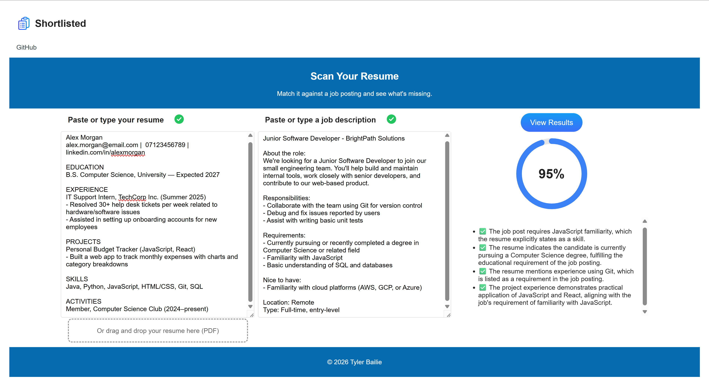

# shortlisted-resume-scanner
> A browser extension that grades how well your resume matches a job post, using a locally-run AI model

**Tech stack:** JavaScript · Chrome Extension API · Gemini Nano

### What it does
A resume and job post scanner that grades how well a job post matches a resume using AI. The user inputs a resume and a job post, and an AI returns a few bullet points explaining the key comparisons between the two documents, and a visual diagram with an overall match score.  
I acknowledge the limited scope and utility of the project. This was a small learning project to learn a new programming language, practice handling user data and AI calls, and to build something real with UI outside the terminal for the first time.  

### Why these technologies
I chose to write this project in JavaScript as I believe the tool is best suited for browser extension format. I also thought JavaScript would be a good new programming language to learn since I already have some proficiency in Java to build on.  
I chose the Gemini Nano model in particular because it is run locally, meaning no external API calls. I believed that, since a CV can contain sensitive information, the project should be as locally run and stored as possible.

### Challenges
The Gemini Nano model had a real tradeoff for it being locally run, and that was it being pretty weak and slow. It often struggled with more complex instructions, and it was difficult to make it output sensible results consistently. I mostly overcame this by chaining prompts, moving as much of its output formatting away from its instructions and to schemas, and parsing the job post's text to remove unnecessary information (like advertisements and links), but it still struggles with very long text due to its 8000 token limit.

### Future features
I would hope to add more proactive features, like recommendations on how you can improve your resume in general, or to appeal to a particular employer's job post, instead of the tool being purely reactionary.  
I would also maybe switch to a stronger model for better and faster results, and focus more on manual security for user data than relying on local storage. 

### Instructions for installation
1. Clone this repo
2. Go to `chrome://extensions`
3. Enable Developer Mode
4. Click "Load unpacked" and select the project folder
